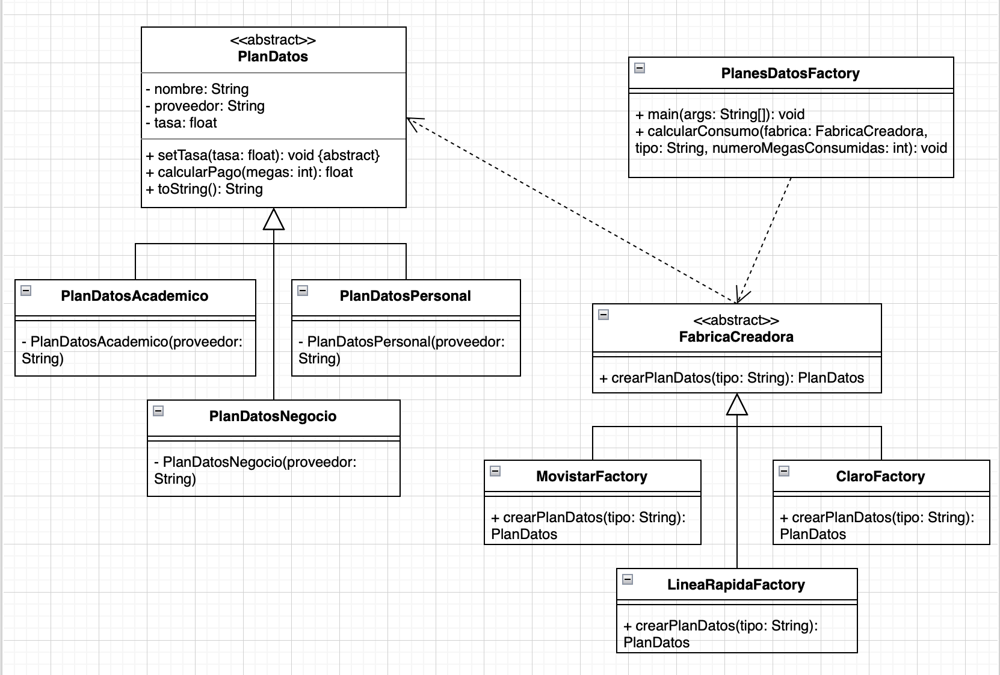

# Factory Method - Ñlanes de Datos para Proveedores de Internet

## Autor

- Nombre: Romero Gordillo, Walter Alexander
- Curso: Patrones de Diseño
- Lenguaje: Java
- Patron utilizado: Factory Method

---

# Descripción

Este proyecto implementa el patrón de diseño **Factory Method** para la creación de diferentes tipos de planes de datos ofrecidos por distintos proveedores de internet.

Inicialmente, la empresa **Linea Rápida** ofrecía tres tipos de planes de datos: 

- Plan Personal
- Plan Negocio
- Plan Académico

Posteriormente, la aplicación fue ampliada para soportar dos nuevos proveedores.

- Claro 
- Movistar

Cada proveedor mantiene los mismos tipos de planes, pero con diferentes tarifas por MB consumidos.

---

# Objetivo

Implementar una solución orientada a objetos utilizando el patrón **Factory Method** permitiendo crear dinámicamente el plan de datos correspondiente según:

- El proveedor seleccionado.
- El tipo de plan elegido.

De esta manera se evita que el cliente instancie diretamente las clases concretas mediante el uso del operador `new`.

---

# Enunciado del profesor

La compañía telefónica **Línea Rápida** ofrece tres tipos de planes de servicio de datos: 

- Plan Personal
- Plan Negocio
- Plan Académico

Las tarifas son las siguientes

|   Plan    | tarifa (S/ por MB) | 
|-----------|--------------------|
| Personal  | S/ 0.50            | 
| Negocio   | S/ 1.00            |
| Académico | S/ 1.00            |

Posteriormente se agregan dos nuevos proveedores:

## Claro

|  Plan     | tarifa (S/ por MB) |
|-----------|--------------------|
| Personal  | S/ 0.60           |
| Negocio   | S/ 1.60            |
| Académico | S/ 1.20            | 

## Movistar


|  Plan     | tarifa (S/ por MB) |
|-----------|--------------------|
| Personal  | S/ 0.80            |
| Negocio   | S/ 1.60            |
| Académico | S/ 1.25            | 

El sistema debe calcular el monto total a pagar de acuerdo con los MB consumidos.

---

# Patrón utilizado

Se utilizó el patrón de diseño **Factory Method**.

## Participantes

### Producto

- `PlanDatos``

# Productos Concretos

- `PlanDatosPersonal`
- `PlanDatosNegocio`
- `PlanDatosAcademico`

### Creador

- `FabricaCreadora``

### Creadores Concretos

- `MovistarFactory`
- `ClaroFactory`
- `LineaRapidaFactory`

### Cliente 

- `Main

# Estructura del proeycto

```text
src/
│
├── Main.java
│
├── PlanesDatosFactory.java
│
├── FabricaCreadora.java
├── MovistarFactory.java
├── ClaroFactory.java
├── LineaRapidaFactory.java
│
├── PlanDatos.java
├── PlanDatosPersona.java
├── PlanDatosNegocio.java
└── PlanDatosAcademico.java
```

---

# Funcionamiento 

1. El usuario selecciona un proveedor.
2. El usuario selecciona un tipo de plan.
3. Ingresa la cantidad de MB consumidas.
4. La fábrica correspondiente crea el objeto adecuado.
5. El sistema calcula el monto total a pagar.
6. Finalmente se muestran los datos del plan y el importe total.

---

# Ejemplo de ejecución

```text
=================================
PLANES DE DATOS INTERNET
=================================

Seleccione el proveedor

1. Movistar
2. Claro
3. Línea Rápida

Opción: 2

Seleccione el tipo de plan

1. Académico
2. Persona
3. Negocio

Opción: 3

Megabytes consumidos: 1000

Proveedor: Claro
Plan: Negocio
Costo por MB: 1.6

Megas consumidos: 1000
Total a pagar: S/. 1600.0
```


---
# Diagrama UML



# Tecnologías utilizadas

- Java 
- Prgramación Orientada a Objetovs (POO)
- Patron de Diseño Factory Method